# SignalHunter 
### Intelligent Optical Telemetry, Degradation Diagnostics ($\Delta\text{dB}$) and High-Performance GPON / EPON Monitoring

> **Engineered for Internet Service Providers (ISPs), Telecom Operators, and NOC Engineering Teams.**  
> Continuous auditing of physical optical parameters (Rx, Tx, OLT-Rx, Attenuation, Temperature, Distance, and Voltage), granular time series, and automated predictive root-cause analysis (RCA).

---

## 🚀 Live Online Demo

Experience SignalHunter in action right now through our official live demonstration environment with an active multi-vendor GPON dataset:

| 🌐 Live URL | 👤 Username | 🔑 Password |
| :--- | :--- | :--- |
| [**https://signalhunter.ispfocus.net.br:8443**](https://signalhunter.ispfocus.net.br:8443) | `demo` | `demo123` |

---

## 🌐 Overview

**SignalHunter** is an enterprise-grade platform developed entirely in asynchronous **Rust** on top of the `tokio` runtime. It was specifically architected to solve the primary operational bottleneck of telecom operators: **silent optical distribution network (ODN) degradation**.

Rather than relying on reactive manual testing after customer trouble tickets are opened, SignalHunter connects directly to OLTs (*Optical Line Terminals*) via a high-resilience proprietary SNMP engine, collecting physical optical telemetry from tens of thousands of ONUs in seconds and automatically computing attenuation variances ($\Delta\text{dB}$) over time.

---

## ⚡ Competitive Advantages

| Advantage | What SignalHunter Delivers |
|---|---|
| **🚀 Extreme Performance & Concurrency** | Written in pure Rust with native compilation. Zero garbage collection pauses, ultra-low memory footprint (< 50 MB RAM), and ability to audit 50,000+ ONUs concurrently without overloading OLT control boards. |
| **🛡️ Resilient SNMP ASN.1 BER Parser** | Proprietary SNMP engine with hierarchical parsing from root `SEQUENCE (0x30)`, strict `Request-ID` verification (anti-cross contamination), and automatic `GetBulk` ➔ `GetNext` fallback on card boundary crossings. |
| **🔍 Early Degradation Detection ($\Delta\text{dB}$)** | Identifies partial fiber breaks, macrobending, fusion splice degradation, and dirty connectors before the ONU enters a critical *Loss of Signal* (LOS) state. |
| **🧠 Intelligent Predictive Diagnostics** | Analytical engine correlating collective signal drops per PON port, instantly diagnosing whether an anomaly is widespread in the feeder cable or isolated at a customer drop cable. |
| **📄 Native Executive PDF Reports** | Instantaneous generation of technical PDF reports with detailed 5-sample history per ONU, network health diagrams, and prioritized field dispatch lists. |
| **🔒 SSDLC & DevSecOps Security** | JWT authentication strictly encapsulated in `HttpOnly`/`Secure` cookies with anti-XSS protection, cryptographic CAPTCHA hashing with `SHA-256`, AES-256-GCM encryption for OLT credentials, and an immutable RBAC audit trail. |
| **💎 Dark/Cyberpunk Neon SPA Interface** | Modern HTML5/CSS Glassmorphism frontend with zero heavy external dependencies (No Node/React/Webpack runtime required), served directly from the Axum binary over a single TLS port. |

---

## ✨ Key Features

- **Real-Time Executive Dashboard**: Consolidated optical network health metrics, dynamic optical power distribution histogram (dBm), quality cards (Saturated, Excellent, Good, Warning, Critical, Offline, and Degradation), and interactive alert table with instant pagination (1,000 records/page).
- **Individual ONU Audit & Historical Time Series**: Modal panel and split-view side drawer allowing deep inspection of an ONU's physical timeline (Rx ONU, Tx ONU, OLT-Rx, Attenuation, Temperature, and $\Delta\text{Rx}$).
- **Signal Degradation Module ($\Delta\text{dB}$)**: Specialized analytical view to isolate ONUs that suffered progressive optical loss between consecutive pollings.
- **Intelligent Optical Diagnostics & Network AI**: Probabilistic anomaly analysis categorized by vendor and PON port with root-cause identification.
- **Multi-Vendor OLT Management**: Centralized inventory with auto-discovery of chassis, firmware, and serials, per-chassis concurrency throttles, configurable inter-port delays, and administrative operational states (*Active* vs *Inactive*).
- **RBAC Access Control & Security Audit Logs**: Comprehensive user management (`admin`, `operator`, `viewer`) and complete traceability logging client IP, timestamp, and executed actions.

---

## 📸 System Demonstration & Screenshots

### 🎬 Interactive Slideshow Demo (Loop Animation)
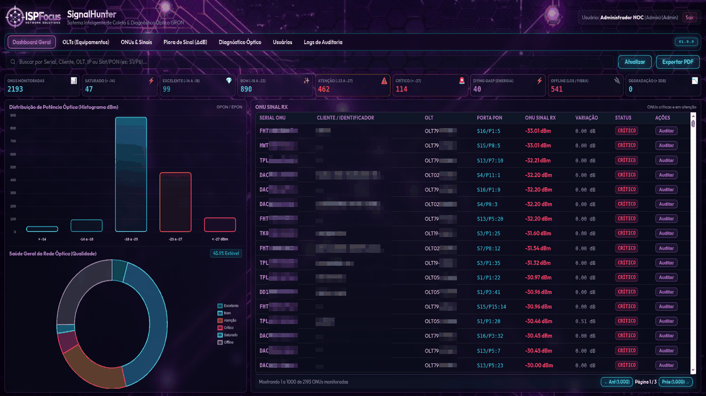

---
### 1. Central Monitoring Dashboard
Executive view with optical signal distribution histogram, global KPIs, and real-time alerts.
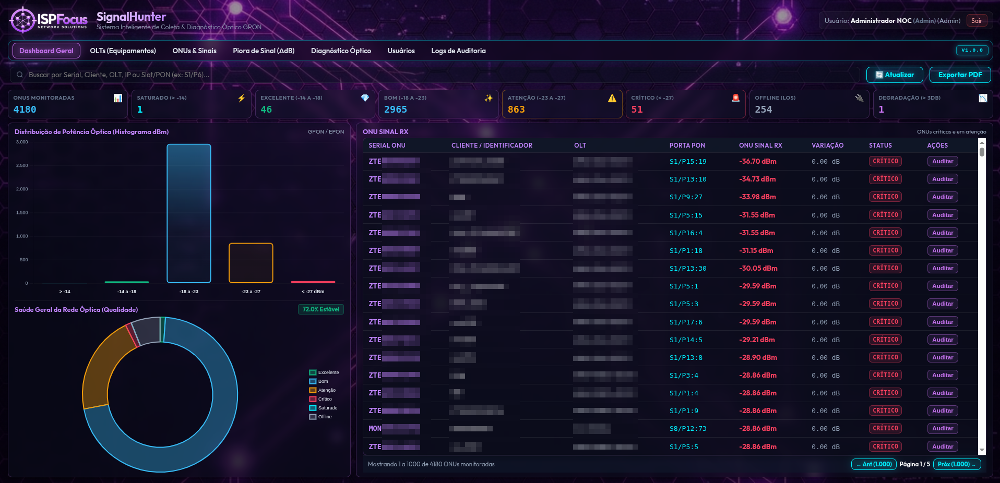

---

### 2. Multi-Vendor Hardware Showcase & Inventory
Interactive hardware management with auto-detected chassis, firmware, operational status, and vendor specifications.

| Nokia / Alcatel-Lucent | Huawei SmartAX GPON |
| :---: | :---: |
| 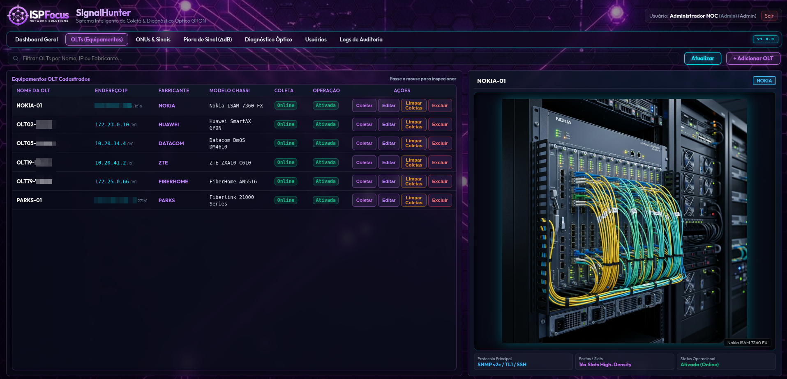 | 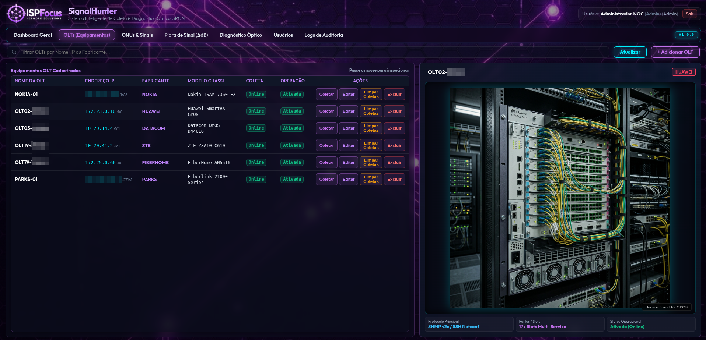 |

| Datacom DmOS | ZTE Titan Series |
| :---: | :---: |
| 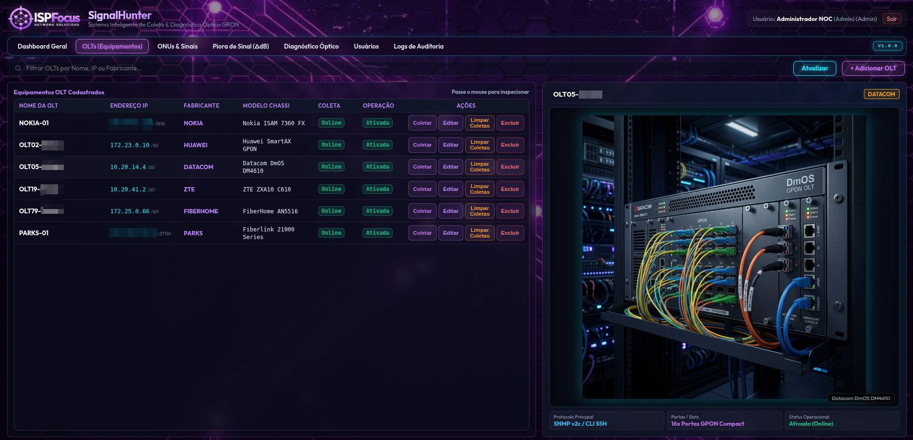 | 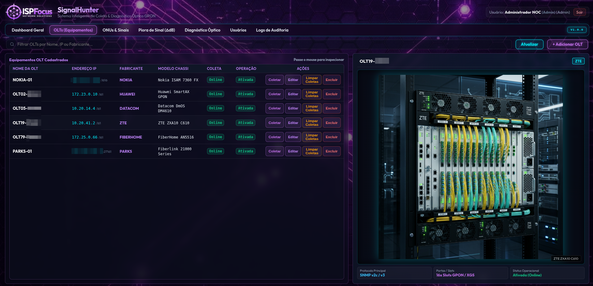 |

| FiberHome AN5516 | Parks Fiberlink |
| :---: | :---: |
| 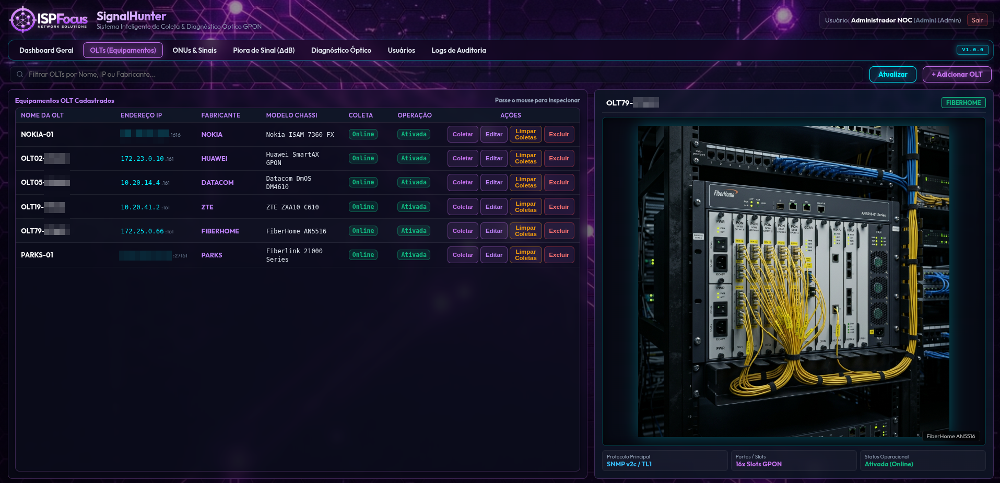 | 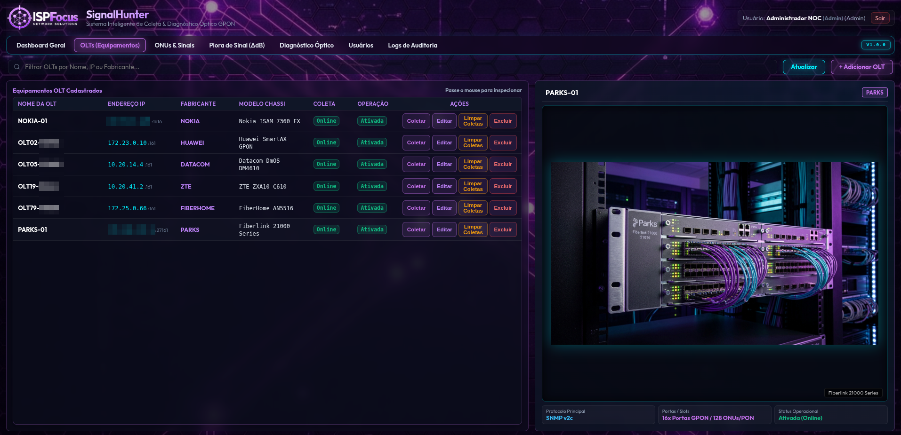 |

---

### 3. High-Density ONU & Signal Explorer with Timeline
Paginated inventory combined with immediate lateral inspection of optical physical parameters and historical degradation ($\Delta\text{dB}$).
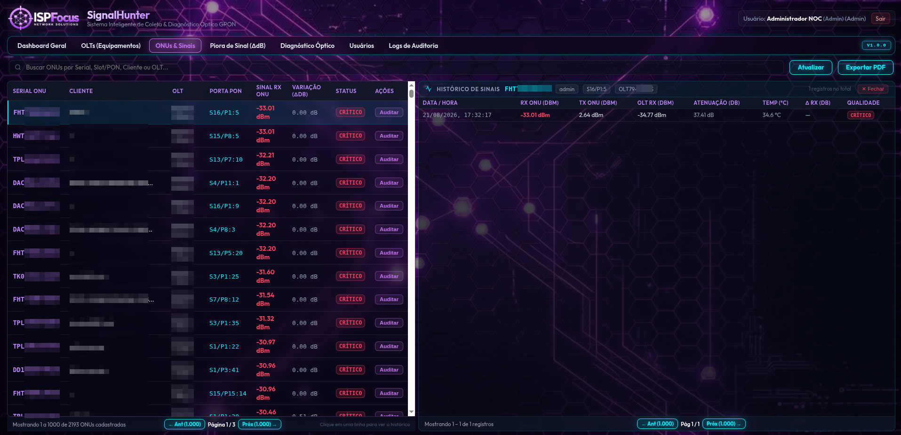

---

### 4. Intelligent Optical Diagnostics (RCA)
Predictive root-cause analysis identifying PON port anomalies, macrobends, and trunk issues.
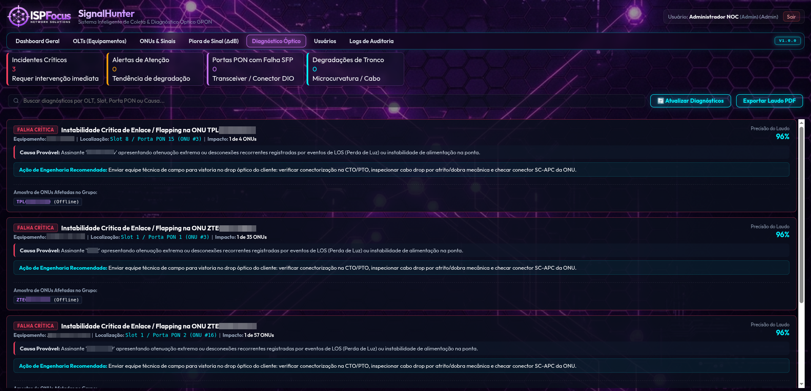

---

### 5. Security Audit Trail & Activity Logs
Immutable chronological log recording all operator and system operations.
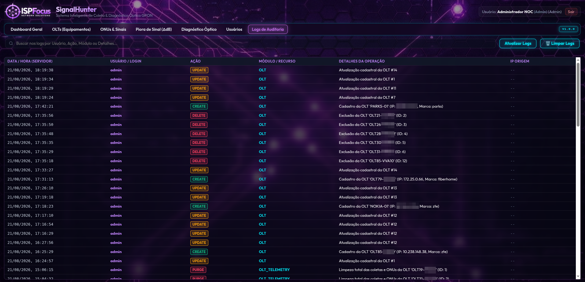

---

## 🏭 Verified Multi-Vendor Support

SignalHunter features specialized native Rust drivers for major telecom equipment manufacturers. The architecture operates **100% via high-speed SNMPv2c** across all vendors, delivering high throughput, non-blocking telemetry and zero dependency on interactive CLI shells:

### 📊 Collection Protocol Matrix by Vendor

| Vendor | Supported Hardware Models | Firmware Compatibility | Protocol | Collected Parameters |
| :--- | :--- | :---: | :---: | :--- |
| **Huawei** | SmartAX MA5800, MA5608T, MA5680T | All VRP Versions | ✅ **SNMPv2c (100%)** | Serials, Rx, Tx, SFP PON Tx, OLT-Rx, Distance (m), Dying Gasp vs LOS, Temp, Voltage, Names |
| **Datacom** | DmOS DM4610, DM4615, DM4618 | **DmOS $\ge$ 12.6** | ✅ **SNMPv2c (100%)** | Real Serial (`.38`), Rx (`.22`), Tx (`.21`), Last Down Reason (`.31`), Primary Status (`.37`), SFP PON Tx, Names (`.5`) |
| **ZTE** | ZXA10 C600, C650, C610 (Titan), C300, C320 | All Versions | ✅ **SNMPv2c (100%)** | Serials, Rx, Tx, Computed OLT-Rx, Distance (m), Temp, Voltage, Names, Last Down Cause (`.1012.3.28.2.1.4`) |
| **FiberHome** | AN5516-01, AN5516-04, AN5516-06 | All Versions | ✅ **SNMPv2c (100%)** | Rx, Tx, Real SFP Tx, Computed OLT-Rx, Temp, Voltage, Bias, Distance, Names |
| **Nokia / Alcatel** | ISAM 7360 FX, 7342, 7330, Lightspan FX | All Versions | ✅ **SNMPv2c (100%)** | Full DDM, Serials, `.88` Drop Alarms (Dying Gasp vs LOS), Rx, Tx, OLT-Rx, Names |
| **Parks** | Fiberlink 30028, 21000, 21016, 21008, 21004 | All Versions | ✅ **SNMPv2c (100%)** | centi-dBm Rx (`.15`), Temp (`.6.1.10`), Names (`.62`), Dying Gasp vs LOS (`.41`/`.5`) |
| **TP-Link** | DeltaStream DS-P7001 (01/04/08/16), DS-P8000 Series | **Firmware $\ge$ 1.2.0** | ✅ **SNMPv2c (100%)** | Serials (`.6`), Rx (`.26`), Tx (`.27`), OLT-Rx (`.28`), Distance (m) (`.18`), Temp (`.31`), Voltage (`.30`), Bias (`.29`), Names (`.5`), Drop Reason (`.42`) |

---

### 📋 Collected Telemetry Metrics by Vendor

| Vendor | Collected Parameters |
|---|---|
| **Huawei** | Serial Number (`.43.1.3`), Customer Name (`.43.1.9`), ONT Model (`.45.1.4`), ONU Rx (`.51.1.4`), ONU Tx (`.51.1.3`), Upstream OLT-Rx (`.51.1.6`), SFP PON Tx (`.23.1.2`), Temperature (`.51.1.1`), Voltage (`.51.1.2`), Last Drop Cause (`.47.1.3`), Distance (`.46.1.20`) |
| **Datacom** | Serial Number (`.38`), Customer Name (`.5`), ONU Rx (`.22`), ONU Tx (`.21`), Last Down Reason (`.31`), Primary Status (`.37`), SFP PON Tx Power (`.3709.3.6.8.2.1.1.3`), Interface L2 Mapping (`.3`) |
| **ZTE** | Serial Number (`.500.20.2.1.2.1.3` / `.300.20.2.1.2.1.3` / `.50.11.2.1.1`), Customer Name (`.500.10.2.3.9.1.2`), ONU Rx (`.500.20.2.2.2.1.10` / `.500.1.2.4.2.1.2`), ONU Tx (`.500.20.2.2.2.1.11` / `.500.1.2.4.2.1.1`), Upstream OLT-Rx (`.500.20.2.2.2.1.12` / `.500.1.2.4.2.1.3`), Distance (`.500.10.2.3.8.1.4`), Temperature (`.500.20.2.2.2.1.13`), Last Down Cause (`.500.10.2.3.8.1.11` / `.1012.3.28.2.1.4`) |
| **FiberHome** | Serial Number (`.800.3.9.3.3.1.2`), Customer Name (`.800.3.9.3.3.1.4`), ONU Rx (`.800.3.9.3.3.1.6`), ONU Tx (`.800.3.9.3.3.1.7`), Temperature (`.800.3.9.3.3.1.8`), Voltage (`.800.3.9.3.3.1.9`), Bias Current (`.800.3.9.3.3.1.10`), Distance (`.800.3.9.3.3.1.11`), Real OLT SFP Tx (`.800.3.9.3.4.1.8`) |
| **Nokia / Alcatel** | Serial Number (`.35.10.1.1.5`), Customer Name (`.35.10.1.1.12`), ONU Operational Status (`.35.10.4.1.8`), Drop Diagnosis (`.35.10.1.1.88`), ONU Rx (`.35.10.14.1.2`), ONU Tx (`.35.10.14.1.3`), Upstream OLT-Rx (`.35.10.18.1.2`) |
| **Parks** | Serial Number (`.5.1.18`), Customer Name / Login (`.5.1.62`), ONT Model (`.5.1.23`), ONU Rx (`.5.1.15`), Transceiver Temperature (`.6.1.10`), Drop Cause (`.5.1.41` / `.5.1.5`) |
| **TP-Link** | Serial Number (`.11863.6.100.1.7.2.1.6`), Customer Name (`.5`), Online Status (`.11`), Vendor ID (`.15`), Equipment Model (`.16`), Distance (`.18`), ONU Rx (`.26`), ONU Tx (`.27`), Upstream OLT-Rx (`.28`), Laser Bias Current (`.29`), Voltage (`.30`), Temperature (`.31`), Drop Cause (`.42`) |

---

### 📡 Technical OID Mapping

#### 1. Huawei (VRP / SmartAX MA5800 & MA5600T Series)
Huawei telemetry polling is executed **100% via SNMPv2c**:
* `ONU Serial Number`: `.1.3.6.1.4.1.2011.6.128.1.1.2.43.1.3.<ifIndex>.<onuId>`
* `Customer Name / Description`: `.1.3.6.1.4.1.2011.6.128.1.1.2.43.1.9.<ifIndex>.<onuId>`
* `ONT Equipment Model`: `.1.3.6.1.4.1.2011.6.128.1.1.2.45.1.4.<ifIndex>.<onuId>`
* `ONU Optical Rx Power (dBm)`: `.1.3.6.1.4.1.2011.6.128.1.1.2.51.1.4.<ifIndex>.<onuId>` (Raw / 100)
* `ONU Optical Tx Power (dBm)`: `.1.3.6.1.4.1.2011.6.128.1.1.2.51.1.3.<ifIndex>.<onuId>` (Raw / 100)
* `Upstream OLT Rx Power (dBm)`: `.1.3.6.1.4.1.2011.6.128.1.1.2.51.1.6.<ifIndex>.<onuId>` ((Raw - 10000) / 100)
* `OLT SFP PON Tx Power (dBm)`: `.1.3.6.1.4.1.2011.6.128.1.1.2.23.1.2.<ifIndex>` (Raw / 100)
* `Transceiver Temperature (°C)`: `.1.3.6.1.4.1.2011.6.128.1.1.2.51.1.1.<ifIndex>.<onuId>`
* `Supply Voltage (V)`: `.1.3.6.1.4.1.2011.6.128.1.1.2.51.1.2.<ifIndex>.<onuId>` (Raw / 100)
* `Last Drop Reason`: `.1.3.6.1.4.1.2011.6.128.1.1.2.47.1.3.<ifIndex>.<onuId>` (`1` = Dying Gasp / Power, `2`/`3` = LOS / Fiber Break)
* `Physical Fiber Distance (m)`: `.1.3.6.1.4.1.2011.6.128.1.1.2.46.1.20.<ifIndex>.<onuId>` (Integer in meters)

---

#### 2. Datacom (DmOS DM4610 / DM4615 / DM4618)
Datacom telemetry polling is executed **100% via SNMPv2c** (requires firmware **DmOS $\ge$ 12.6**):
* `ONU Serial Number`: `.1.3.6.1.4.1.3709.3.6.2.1.1.38.<ifIndex>` (onuIfSerialNumber)
* `Customer Name / Description`: `.1.3.6.1.4.1.3709.3.6.2.1.1.5.<ifIndex>` (onuIfName)
* `ONU Optical Rx Power (dBm)`: `.1.3.6.1.4.1.3709.3.6.2.1.1.22.<ifIndex>` (onuIfOnuPowerRx)
* `ONU Optical Tx Power (dBm)`: `.1.3.6.1.4.1.3709.3.6.2.1.1.21.<ifIndex>` (onuIfOnuPowerTx)
* `Last Down Reason`: `.1.3.6.1.4.1.3709.3.6.2.1.1.31.<ifIndex>` (onuIfLastDownReason)
* `Primary Operational Status`: `.1.3.6.1.4.1.3709.3.6.2.1.1.37.<ifIndex>` (onuIfPrimaryStatus)
* `OLT SFP PON Tx Power (dBm)`: `.1.3.6.1.4.1.3709.3.6.8.2.1.1.3.<portIndex>` (laneTxPower - Raw / 100)
* `L2 Interface Mapping`: `.1.3.6.1.4.1.3709.3.6.2.1.1.3.<ifIndex>` (onuifDescr, e.g., "gpon-1/1/1-onu-0")

> **Special Thanks**: A heartfelt acknowledgment to **Tatiane Figueiredo** (`tatiane.figueiredo@gmail.com`) for collaborating with the project by providing the official Datacom MIB Reference and guiding the precise OID mappings.

---

#### 3. ZTE (ZXA10 C300 / C320 / C600 / C610 Titan Series)
ZTE telemetry polling is executed **100% via SNMPv2c**:
* `ONU Serial Number`: `.1.3.6.1.4.1.3902.1082.500.20.2.1.2.1.3` (Titan C600) / `.1.3.6.1.4.1.3902.1082.300.20.2.1.2.1.3` (C300) / `.1.3.6.1.4.1.3902.1012.3.50.11.2.1.1` (C300 Legacy)
* `Customer Name / Description`: `.1.3.6.1.4.1.3902.1082.500.10.2.3.9.1.2.<ifIndex>.<onuId>`
* `ONU Optical Rx Power (dBm)`: `.1.3.6.1.4.1.3902.1082.500.20.2.2.2.1.10` (Titan) / `.1.3.6.1.4.1.3902.1082.500.1.2.4.2.1.2` (C300)
* `ONU Optical Tx Power (dBm)`: `.1.3.6.1.4.1.3902.1082.500.20.2.2.2.1.11` (Titan) / `.1.3.6.1.4.1.3902.1082.500.1.2.4.2.1.1` (C300)
* `Upstream OLT Rx Power (dBm)`: `.1.3.6.1.4.1.3902.1082.500.20.2.2.2.1.12` (Titan) / `.1.3.6.1.4.1.3902.1082.500.1.2.4.2.1.3` (C300)
* `Transceiver Temperature (°C)`: `.1.3.6.1.4.1.3902.1082.500.20.2.2.2.1.13` (Titan) / `.1.3.6.1.4.1.3902.1082.500.1.2.4.2.1.5` (C300)
* `Physical Fiber Distance (m)`: `.1.3.6.1.4.1.3902.1082.500.10.2.3.8.1.4.<ifIndex>.<onuId>`
* `Last Down Cause (Dying Gasp vs LOS)`: `.1.3.6.1.4.1.3902.1082.500.10.2.3.8.1.11` / `.1.3.6.1.4.1.3902.1012.3.28.2.1.4` (`1` = Dying Gasp / Power, `2` = LOS / Fiber Break)

---

#### 4. FiberHome (AN5516-01 / AN5516-04 / AN5516-06 Series)
FiberHome polling is executed **100% via SNMPv2c**:
* `ONU Serial Number`: `.1.3.6.1.4.1.5875.800.3.9.3.3.1.2.<slot>.<port>.<onu>`
* `Customer Name / Description`: `.1.3.6.1.4.1.5875.800.3.9.3.3.1.4.<slot>.<port>.<onu>`
* `Real OLT SFP PON Tx Power (dBm)`: `.1.3.6.1.4.1.5875.800.3.9.3.4.1.8.<slot>.<port>` (Raw / 100.0)
* `ONU Optical Rx Power (dBm)`: `.1.3.6.1.4.1.5875.800.3.9.3.3.1.6.<slot>.<port>.<onu>` (Raw / 100.0)
* `ONU Optical Tx Power (dBm)`: `.1.3.6.1.4.1.5875.800.3.9.3.3.1.7.<slot>.<port>.<onu>` (Raw / 100.0)
* `Transceiver Temperature (°C)`: `.1.3.6.1.4.1.5875.800.3.9.3.3.1.8.<slot>.<port>.<onu>` (Raw / 10.0)
* `Supply Voltage (V)`: `.1.3.6.1.4.1.5875.800.3.9.3.3.1.9.<slot>.<port>.<onu>` (Raw / 100.0)
* `Bias Current (mA)`: `.1.3.6.1.4.1.5875.800.3.9.3.3.1.10.<slot>.<port>.<onu>` (Raw / 1000.0)
* `Physical Fiber Distance (m)`: `.1.3.6.1.4.1.5875.800.3.9.3.3.1.11.<slot>.<port>.<onu>`

---

#### 5. Nokia / Alcatel-Lucent (ISAM 7360 FX / Lightspan FX Series)
Nokia polling is executed **100% via SNMPv2c**:
* `ONU Serial Number`: `.1.3.6.1.4.1.637.61.1.35.10.1.1.5`
* `Customer Name / Description`: `.1.3.6.1.4.1.637.61.1.35.10.1.1.12`
* `ONU Operational Status`: `.1.3.6.1.4.1.637.61.1.35.10.4.1.8` (`12`/`1` = Online)
* `Drop Diagnosis (Dying Gasp vs LOS)`: `.1.3.6.1.4.1.637.61.1.35.10.1.1.88` (`256` = Dying Gasp / Power Outage, `2` = LOS / Fiber Break)
* `ONU Optical Rx Power (dBm)`: `.1.3.6.1.4.1.637.61.1.35.10.14.1.2` (Raw * 0.002 dBm)
* `ONU Optical Tx Power (dBm)`: `.1.3.6.1.4.1.637.61.1.35.10.14.1.3`
* `Upstream OLT Rx Power (dBm)`: `.1.3.6.1.4.1.637.61.1.35.10.18.1.2` (Raw / 10.0 dBm)

---

#### 6. Parks (Fiberlink 30028 / 21000 / 21016 Series)
Parks polling is executed **100% via SNMPv2c**:
* `ONU Serial Number (Hex/ASCII)`: `.1.3.6.1.4.1.6771.10.1.5.1.18.<slot>.<port>.<onu>` (e.g., `PRKS00C418A1`)
* `Customer Name / Login`: `.1.3.6.1.4.1.6771.10.1.5.1.62.<slot>.<port>.<onu>`
* `ONT Model (Hex/ASCII)`: `.1.3.6.1.4.1.6771.10.1.5.1.23.<slot>.<port>.<onu>`
* `ONU Optical Rx Power (dBm)`: `.1.3.6.1.4.1.6771.10.1.5.1.15.<slot>.<port>.<onu>` (centi-dBm scale: `2638` $\rightarrow -26.38\text{ dBm}$)
* `Transceiver Temperature (°C)`: `.1.3.6.1.4.1.6771.10.1.6.1.10.<slot>.<port>.<onu>.2` (Raw / 10.0)
* `Drop Cause Diagnosis`: `.1.3.6.1.4.1.6771.10.1.5.1.41` (`1` = Dying Gasp / Power Outage, `0` = LOS / Fiber Break) and `.1.3.6.1.4.1.6771.10.1.5.1.5` (`3` = Online, `1` = Dying Gasp, `0` = LOS)

---

#### 7. TP-Link (DeltaStream DS-P7001-04 / DS-P7001-08 / DS-P7001-16 / DS-P8000 Series)
TP-Link DeltaStream polling is executed **100% via SNMPv2c** (indexed by `{slot, port, onu_id}`):
* `ONU Serial Number`: `.1.3.6.1.4.1.11863.6.100.1.7.2.1.6.<slot>.<port>.<onu>` (`omSerialNumber`)
* `Customer Name / Description`: `.1.3.6.1.4.1.11863.6.100.1.7.2.1.5.<slot>.<port>.<onu>` (`omOnuDescription`)
* `Online Status`: `.1.3.6.1.4.1.11863.6.100.1.7.2.1.11.<slot>.<port>.<onu>` (`1` = Online, `0` = Offline)
* `Vendor ID`: `.1.3.6.1.4.1.11863.6.100.1.7.2.1.15.<slot>.<port>.<onu>` (`omVendorId`, e.g., `TPLG`, `ZTEG`, `HWTC`)
* `Equipment Model`: `.1.3.6.1.4.1.11863.6.100.1.7.2.1.16.<slot>.<port>.<onu>` (`omEquipmentId`)
* `Physical Fiber Distance (m)`: `.1.3.6.1.4.1.11863.6.100.1.7.2.1.18.<slot>.<port>.<onu>` (`omDistance`)
* `ONU Optical Rx Power (dBm)`: `.1.3.6.1.4.1.11863.6.100.1.7.2.1.26.<slot>.<port>.<onu>` (`omReceivedOpticalPower`)
* `ONU Optical Tx Power (dBm)`: `.1.3.6.1.4.1.11863.6.100.1.7.2.1.27.<slot>.<port>.<onu>` (`omTransmittedOpticalPower`)
* `Upstream OLT Rx Power (dBm)`: `.1.3.6.1.4.1.11863.6.100.1.7.2.1.28.<slot>.<port>.<onu>` (`omOltReceivedOpticalPower`)
* `Laser Bias Current (mA)`: `.1.3.6.1.4.1.11863.6.100.1.7.2.1.29.<slot>.<port>.<onu>` (`omBiasCurrent`)
* `Supply Voltage (V)`: `.1.3.6.1.4.1.11863.6.100.1.7.2.1.30.<slot>.<port>.<onu>` (`omWorkingVoltage` - Raw mV / 1000.0)
* `Transceiver Temperature (°C)`: `.1.3.6.1.4.1.11863.6.100.1.7.2.1.31.<slot>.<port>.<onu>` (`omWorkingTemperature`)
* `Last Down Reason`: `.1.3.6.1.4.1.11863.6.100.1.7.2.1.42.<slot>.<port>.<onu>` (`omOnuLastDownCauses`, e.g., `LOS`, `Dying Gasp`)

---

## 🎯 Optical Signal Power Classification (Downstream Rx)

| Classification | Optical Power Range | Badge Color | Recommended NOC Action |
|---|---|---|---|
| **💎 Excellent** | $-14.00\text{ dBm}$ to $-18.00\text{ dBm}$ | Emerald Green | Ideal operational state without attenuation |
| **✨ Good / Normal** | $-18.01\text{ dBm}$ to $-23.00\text{ dBm}$ | Cyan / Sky Blue | Standard operational GPON range |
| **⚠️ Warning** | $-23.01\text{ dBm}$ to $-27.00\text{ dBm}$ | Amber / Orange | Preventive: inspect connectors and splitters |
| **🚨 Critical** | $< -27.00\text{ dBm}$ | Crimson Red | Immediate field dispatch for optical repair |
| **⚡ Saturated** | $> -14.00\text{ dBm}$ | Neon Blue | Insert optical attenuator (photodiode overload risk) |
| **🔌 Offline (LOS)** | No signal / Disconnected | Dark Slate | Fiber cut or powered-off equipment |

---

## 🚀 Installation & Deployment

For step-by-step instructions on installing **Rust**, compiling the standalone *release* binary, configuring **MariaDB/MySQL**, provisioning **TLS/HTTPS certificates**, and setting up the **Systemd** service on Linux (Debian 13), refer to the installation manual:

📖 **[Access the Installation & Deployment Guide (INSTALL.md)](INSTALL.md)**  
*(Para a versão em português, consulte [INSTALACAO.md](INSTALACAO.md))*

---

## ⚖️ Trademark, Brand Policy & Disclaimer

While the source code of this project is released as Free and Open Source Software under the GNU GPLv3 license, the visual identity, logos, and the company and trade name **ISPFocus Serviços e Tecnologia Ltda** are proprietary intellectual property.

- **Permitted Use:** The logos and visual identity may be used solely in direct connection with this software in its original and genuine form.
- **Restrictions:** The use of the logos, visual identity, or the company name in derivative works, commercial forks, or third-party services without prior written permission is strictly prohibited. For details, see [TRADEMARKS.md](TRADEMARKS.md).
- **Disclaimer of Liability:** The author and **ISPFocus Serviços e Tecnologia Ltda** shall not be held liable for any direct, indirect, or consequential damages resulting from the use or operation of this software. The software is provided "AS IS", without warranty of any kind.

---

## 📄 License and Support

Developed by **[ISPFocus Serviços e Tecnologia Ltda](https://ispfocus.net.br)**.  
For enterprise support, commercial licensing, or custom driver integrations, visit [ispfocus.net.br](https://ispfocus.net.br).
